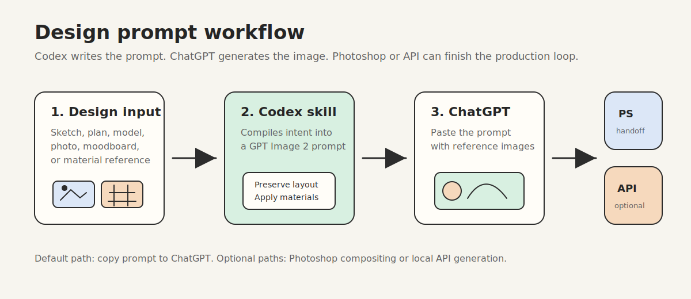
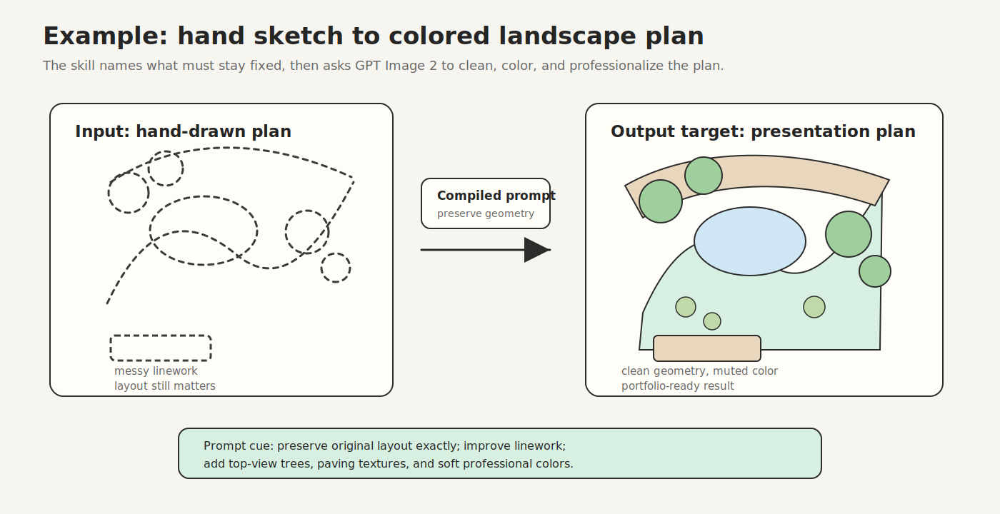
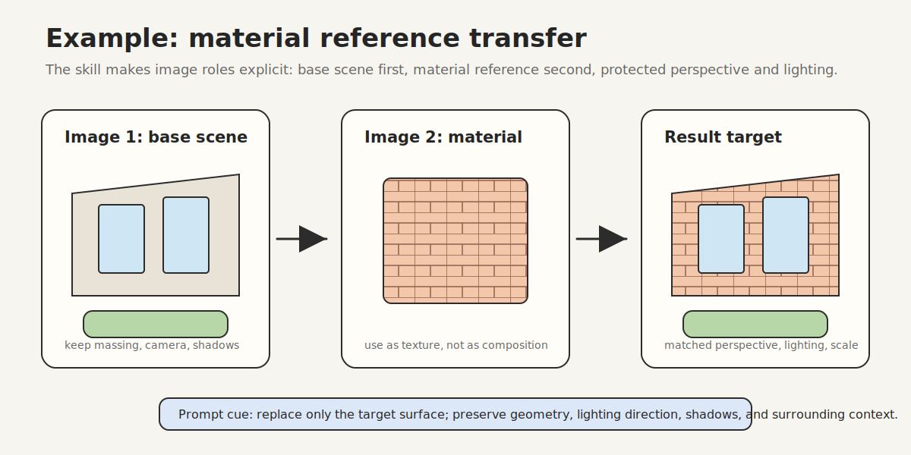
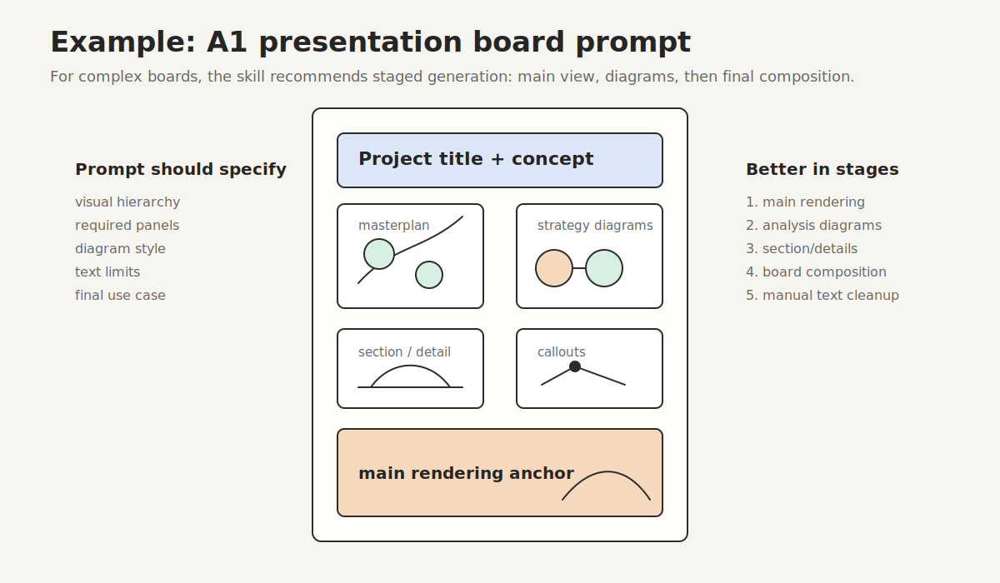

# GPT Image Design Prompts

一个面向建筑、景观、室内、城市设计的 Codex skill，用来把设计需求编译成适合 GPT Image 2 / ChatGPT Images 的高质量生图提示词。

这个 skill 的默认定位很简单：**Codex 负责写 prompt，ChatGPT 负责生图**。你可以把草图、平面图、SU 模型截图、现场照片、材质参考、情绪板或展板需求交给 Codex，它会输出英文主 prompt、中文意图说明、ChatGPT 使用步骤，以及可选的 API 参数建议。



> 示例配图是概念示意图，用来解释工作流和 prompt 结构，不代表某一次模型生成结果。

## 适合谁使用

- 建筑、景观、城市设计、室内设计学生
- 需要快速把草图、模型或照片转成表现图的设计师
- 需要把方案拆成渲染图、分析图、轴测图、展板图的作品集用户
- 想把 GPT Image 2 纳入设计流程，但不想每次从零写 prompt 的人

## 能做什么

- 草图 / SU 模型 / 白模转真实感建筑渲染
- 手绘景观平面转彩色总平面、CAD 线稿、60 度轴测图
- 现场照片改造、旧建筑更新、街景改造
- 立面、铺装、海报、材质参考重贴图
- 平面图转鸟瞰、人眼高度透视、庭院视角
- 室内平面图转室内效果图
- 情绪板、材质板、植物板
- 建筑体量演变图、功能分析图、剖面图
- 场地时间轴分析图
- A1 展板、竞赛图板 prompt
- 建筑 / 景观 / 城市设计连续工作流拆解

## 工作方式

这个 skill 有三种使用模式。

### 1. ChatGPT 复制粘贴模式，默认推荐

这是最常用、也最稳的方式。

1. 在 Codex 里调用这个 skill。
2. 描述你的设计任务，必要时上传或说明参考图。
3. Codex 输出英文 `GPT Image 2 Prompt`。
4. 在 ChatGPT Desktop 或网页端上传参考图。
5. 复制 prompt 到 ChatGPT，让它调用图片生成或图片编辑。
6. 根据结果继续让 Codex 帮你写下一轮修改 prompt。

示例：

```text
Use $gptimage-design-prompts 帮我把这张手绘景观平面图转成 GPT Image 2 prompt。
目标是彩色总平面，保留原始布局、树木位置和路径关系，风格要适合作品集。
```

输出会类似：

```markdown
## GPT Image 2 Prompt
[English prompt ready to paste into ChatGPT]

## 中文意图说明
[说明目标效果、需要保留的内容、需要修改的内容]

## ChatGPT 使用方式
[上传哪些参考图、复制哪段 prompt、下一轮怎么改]

## Recommended API Settings
model: gpt-image-2
mode: edit
size: 1536x1024
quality: high
```

### 2. Photoshop Handoff 模式，手动联动

这个 skill 不能直接控制 Photoshop，也不会自动把 ChatGPT 生成结果塞回 PSD。它更适合作为 Photoshop 前后的 prompt 编译器。

推荐流程：

1. 在 Photoshop 中导出当前画面、局部截图、草图、平面图或材质参考。
2. 在 Codex 中用这个 skill 生成 GPT Image 2 prompt。
3. 把参考图和 prompt 放进 ChatGPT 生图或改图。
4. 把生成结果拖回 Photoshop。
5. 用图层、蒙版、曲线、色彩平衡、透视变换继续合成。

适合场景：

- 保留原图构图，改建筑立面材质
- 给景观平面局部增加材质或植物氛围
- 生成一张新的主视觉后回到 PS 做展板
- 先在 ChatGPT 生成方案氛围，再在 PS 里做精修

你可以这样问：

```text
Use $gptimage-design-prompts 帮我写一个 Photoshop handoff prompt。
我会从 PS 导出一张街角旧建筑照片，还会导出一张玻璃砖材质参考图。
目标是改造成现代街角咖啡馆，结果要方便我放回 PS 做图层合成。
```

### 3. API 模式，可选预留

如果你有 OpenAI API key，可以显式要求 Codex 走 API 模式。普通使用不需要 API key。

安装依赖：

```bash
python -m pip install openai
```

设置环境变量：

```bash
export OPENAI_API_KEY="your-api-key"
```

生成图片：

```bash
python scripts/generate_gpt_image.py \
  --prompt "Create a photorealistic architectural visualization..." \
  --size 1536x1024 \
  --quality high \
  --output-dir ./outputs
```

编辑图片：

```bash
python scripts/generate_gpt_image.py \
  --mode edit \
  --input-image ./base-scene.png \
  --input-image ./material-reference.png \
  --prompt "Replace the plaza paving with the material from the second image..." \
  --size 1536x1024 \
  --quality high \
  --output-dir ./outputs
```

如果没有 `OPENAI_API_KEY`，脚本会明确退出，不会创建空文件或假装生成图片。

## 安装到 Codex

把这个仓库复制到本地 Codex skills 目录：

```bash
mkdir -p ~/.codex/skills
cp -R gptimage-design-prompts ~/.codex/skills/
```

如果 skill 没有立刻出现，重启 Codex。

## 推荐提问格式

为了得到更稳定的 prompt，尽量说明这些信息：

```text
Use $gptimage-design-prompts

输入类型：手绘草图 / 平面图 / SU 模型截图 / 现场照片 / 材质参考 / 情绪板
任务目标：转渲染 / 改造 / 重贴图 / 转轴测 / 做分析图 / 做展板
必须保留：布局、比例、视角、树木位置、建筑体量、路径关系等
允许修改：材质、植物、家具、灯光、氛围、标注方式等
目标风格：MIR 渲染、竞赛图板、CAD 线稿、粉彩图解、真实感、极简室内等
输出用途：作品集、竞赛、客户沟通、课堂汇报、PS 后期合成
```

## 常用示例

### 手绘景观平面转彩色总平面



```text
Use $gptimage-design-prompts 帮我把手绘景观平面图转成 GPT Image 2 prompt。
目标是干净的彩色景观总平面，必须保留原始布局、路径、铺装边界、树木和灌木位置。
风格要适合作品集，颜色柔和，图面专业。
```

### SU 模型截图转建筑渲染

```text
Use $gptimage-design-prompts 给这张 SketchUp 模型截图写一个 GPT Image 2 prompt。
保留相机角度、建筑比例和体量关系，生成 MIR 风格建筑渲染。
材质包括玻璃幕墙、浅色混凝土和木质入口，加入柔和日光、街道环境和少量人物。
```

### 旧建筑照片改造成咖啡馆



```text
Use $gptimage-design-prompts 帮我写照片改造 prompt。
输入是一张街角旧建筑照片，目标是改造成现代街角咖啡馆。
保留原始体量、街角位置和相机视角，更新立面为玻璃砖、极简招牌、转角窗和户外座位。
```

### 平面图转 60 度轴测图

```text
Use $gptimage-design-prompts 把这张景观平面图转成 60 度等轴测 prompt。
严格保持平面布局、比例、建筑、路径、水景和种植分区不变。
效果要适合景观竞赛图板，真实但克制，有自然光和轻微阴影。
```

### 城市设计图板



```text
Use $gptimage-design-prompts 帮我拆一个城市设计 A1 展板 prompt。
我有 SU 模型截图和一张主渲染，目标是生成竞赛级城市设计图板。
需要包含总体规划、功能分析、步行流线、公共空间网络、绿色基础设施和底部主视觉。
```

## 输出尺寸建议

ChatGPT 中通常用自然语言描述构图比例：

- 建筑或景观透视：`landscape 3:2 composition`
- 室内透视：`landscape interior visualization composition`
- A1 展板、剖面、立面、海报：`vertical poster composition`
- 情绪板、材质板、图标组：`square board-like composition`

API 模式下可使用：

- `1536x1024`：横向建筑渲染、景观透视、街景、城市设计视图
- `1024x1536`：竖向展板、剖面、立面、海报
- `1024x1024`：情绪板、材质板、方形图解、模块化小图
- `auto`：不确定时交给模型判断

## 为什么默认用英文主 Prompt

中文 prompt 也能用，但建筑可视化里很多关键词用英文更稳定，例如：

- `photorealistic architectural visualization`
- `MIR-style rendering`
- `clean axonometric diagram`
- `CAD-like black linework`
- `competition presentation board`
- `soft natural daylight`

所以这个 skill 默认输出英文主 prompt，并用中文解释意图。若图片中需要中文标注，应把中文文字单独列出，并明确要求模型精确渲染。

## 文件结构

```text
gptimage-design-prompts/
├── SKILL.md
├── agents/
│   └── openai.yaml
├── assets/
│   └── examples/
├── references/
│   ├── gpt-image-2-api.md
│   └── prompt-patterns.md
└── scripts/
    └── generate_gpt_image.py
```

- `SKILL.md`：核心工作流和输出格式
- `assets/examples/`：README 示例配图
- `references/prompt-patterns.md`：设计场景 prompt 模板库
- `references/gpt-image-2-api.md`：API 模式说明
- `scripts/generate_gpt_image.py`：可选 API 生图脚本
- `agents/openai.yaml`：Codex skill 元数据

## 使用限制

- 精确文字、密集标注、完整 A1 展板排版可能需要多轮修正。
- 严格比例、CAD 精度和施工图级准确性不能完全依赖生图模型。
- 复杂工作流建议拆成多步：先主渲染，再分析图，再展板组合。
- API 模式需要 OpenAI API key、模型权限和可用额度。
- ChatGPT Desktop 不能直接读取本地 Codex skill；默认做法仍然是 Codex 生成 prompt，再复制到 ChatGPT。

## License

MIT
